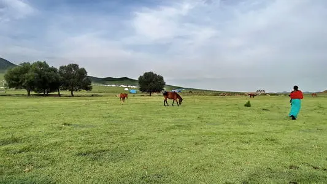
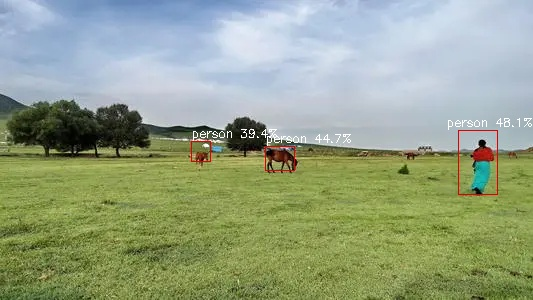

# nanodet_rknn
nanodet_rknn on rk3399pro platform

# dependence 

Make sure your platform has installed rknn_toolkit v1.60, please refer to [link](http://t.rock-chips.com/forum.php?mod=forumdisplay)

- opencv 4+ (3+ is ok but no tested)

# usage 

``` shell
mkdir build 
cd build 
cmake ..
make
```

# results


